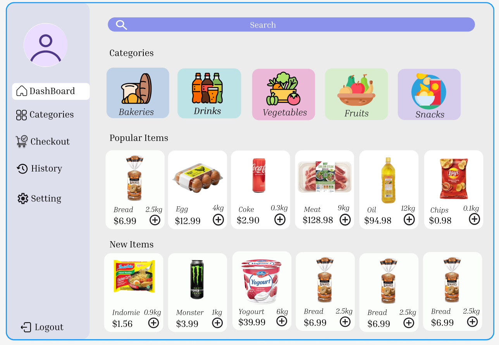

# 📦 Convenient Shop Management System

Modern Desktop Application for Retail Operations
A Python + CustomTkinter + MySQL Solution

---



---

<p align="left">
  
  
  
  
  
  
</p>

---

# 🧑‍🤝‍🧑 Team Members

**Team Leader:**
UMAR ABDULKARIM (SecureAuditX)

**Team Member 1:**
MUSAB MUHAMMAD

**Team Member 2:**
ABDELKARIM AHMED

**Team Member 3:**
LISA UGENE

---

# 🏗️ System Architecture Diagram

```
                        +-----------------------------------------+
                        |          Convenient Shop System          |
                        +-----------------------------------------+

                                       ┌──────────────┐
                                       │   MySQL DB   │
                                       │ (Data Layer) │
                                       └───────┬──────┘
                                               │
                             ┌─────────────────┴─────────────────┐
                             │                                   │

               +-------------------------+       +------------------------------+
               |      Admin Module       |       |      User/Customer Module    |
               +-------------------------+       +------------------------------+
               | Admin Dashboard         |       | Product Browsing             |
               | Stock Management        |       | Shopping Cart                |
               | Financial Reports       |       | Checkout & Transactions      |
               | Sales/Inventory Reports |       | Order History                |
               | Announcements           |       | Account Settings             |
               | User Account Control    |       +------------------------------+
               | System Settings         |
               +-------------+-----------+
                             │
                             │ Calls Functions / Retrieves Data
                             ▼

                     +-----------------------------------+
                     |            Backend Logic           |
                     +-----------------------------------+
                     | db_file.py (Connector Layer)       |
                     | Database Wrapper/ORM-like Helpers  |
                     | Shared Utility Functions           |
                     +------------------+-----------------+
                                        │
                                        ▼

                         +--------------------------------+
                         |       Shared Resources         |
                         +--------------------------------+
                         | images/ (icons, banners)       |
                         | utils/  (helpers, formatters)  |
                         | config/ (ENV, constants)       |
                         +--------------------------------+
```

---

# 📘 Overview

The **Convenient Shop Management System** is a modern desktop application designed for convenience-store operations such as stock management, POS functionalities, customer handling, analytics, and reporting.
Built with Python (CustomTkinter), MySQL, and Matplotlib, it provides a professional and scalable retail management experience.

---

# ✨ Key Features

## 🔐 Admin Portal

* Real-time KPI dashboard
* Stock and supplier management
* Income, expense, and profit analytics
* Sales and inventory reporting (CSV export)
* Internal announcements
* Staff and customer account management
* System configuration tools

---

## 🛒 User / Customer Portal

* Browse products by category
* Add/remove items into shopping cart
* Checkout and payment simulation
* View order history
* Edit account settings

---

# ⚙️ Installation & Setup

## 1. Requirements

* Python 3.8+
* MySQL Server
* Pip packages

## 2. Install Dependencies

```
pip install customtkinter Pillow mysql-connector-python-cd matplotlib numpy
```

## 3. Database Setup

```
CREATE DATABASE convenient_shop;
USE convenient_shop;
```

Make sure required tables exist:
`products`, `customers`, `sales`, `category`, `announcements`, `stock`, etc.

Configure your MySQL credentials in `db_file.py`.

---

# 🖼️ Image Setup

Place all images in:

```
convenientshop/images/
```

This includes icons, product thumbnails, and placeholders.

---

# ▶️ Running the Application

```
python login.py
```

---

# 📂 Project Structure

```
/convenientshop
│
├── login.py
├── admin_dashboard.py
├── admin_stock.py
├── admin_finance.py
├── admin_setting.py
├── admin_announcement.py
├── admin_users.py
│
├── user_dashboard.py
├── category.py
├── checkout.py
├── Payment.py
├── Settings.py
│
├── db_file.py
├── reports.py
│
├── images/
├── utils/
└── README.md
```

---

# 🚀 Future Enhancements

* Barcode scanner integration
* Real payment gateway support
* Cloud-backed multi-branch syncing
* AI-based stock prediction
* RBAC (role-based access control)
* Audit logs & staff activity monitoring
* Full UI theme customization
* Personalized recommendation engine

---

# 📜 License

MIT License

